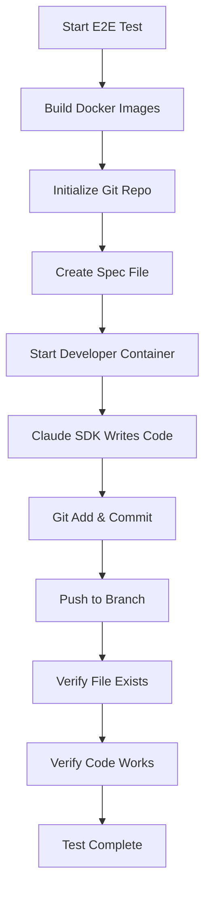

# End-to-End Docker Testing Guide

## Overview

The E2E Docker tests in `tests/test_docker_e2e.py` are **real integration tests** that validate the complete workflow of Claude SDK running in Docker containers, writing code, and performing git operations **against a real GitHub repository**.

Unlike the unit tests which mock container execution, these tests:
- ✅ Actually build Docker images
- ✅ Actually start Docker containers
- ✅ **Actually clone a real GitHub repository** (`biztechprogramming/Wexflow`)
- ✅ Actually run Claude SDK with real API calls
- ✅ Actually write code to files
- ✅ Actually execute git add/commit/push operations **to the real repository**
- ✅ Actually verify code was generated correctly

**IMPORTANT**: These tests use the real repository `git@github.com:biztechprogramming/Wexflow.git`. This means:
- Tests will create real branches in the repository
- Code will be actually committed and pushed
- You need SSH access or can override with `E2E_REPO_URL` environment variable

## Prerequisites

### 1. Docker Installation
```bash
# Verify Docker is installed and running
docker --version
docker ps
```

### 2. Claude Code OAuth Token
```bash
# Set up OAuth token (required for Claude API access)
claude setup-token

# Or export directly
export CLAUDE_CODE_OAUTH_TOKEN=your_token_here
```

### 3. GitHub Repository Access

**Default Repository**: `git@github.com:biztechprogramming/Wexflow.git`

The E2E tests clone and push to this **real repository**. You need either:

**Option A: SSH Access (Default)**
```bash
# Ensure you have SSH keys set up for GitHub
ssh -T git@github.com  # Should succeed

# Docker containers need access to your SSH keys
# The containers should mount your SSH keys automatically
```

**Option B: HTTPS with Token (Override)**
```bash
# Use HTTPS URL with personal access token
export E2E_REPO_URL="https://YOUR_TOKEN@github.com/biztechprogramming/Wexflow.git"

# Or use a different repository entirely
export E2E_REPO_URL="https://YOUR_TOKEN@github.com/yourusername/your-test-repo.git"
```

### 4. Built Docker Images
The tests will build images automatically, but you can pre-build them:
```bash
npm run rebuild:containers
```

### 5. Local Test Repository (Optional)

By default, E2E tests use temporary repositories that are created and destroyed for each test run. For more realistic testing scenarios, you can use a persistent test repository:

```bash
# Create a persistent test repository
mkdir C:\dev\ai\test
cd C:\dev\ai\test
git init
git config user.name "Test User"
git config user.email "test@example.com"

# Create initial commit
echo "# Test Repository" > README.md
git add README.md
git commit -m "Initial commit"
git branch -M main

# Set environment variable to use persistent repo
export E2E_TEST_REPO=C:\dev\ai\test
```

**Benefits of Persistent Test Repository:**
- ✅ Tests preserve artifacts between runs for debugging
- ✅ Validates actual git push/pull operations
- ✅ More closely simulates real-world usage
- ✅ Allows manual inspection of generated code

**Warning:** Tests will create branches and commits in this repository. Review and clean up periodically:
```bash
cd C:\dev\ai\test
git branch -a  # View all branches
git branch -D auto-claude/*  # Clean up test branches
```

## Running E2E Tests

### Run All E2E Tests
```bash
# Full E2E test suite (expensive - uses Claude API credits)
pytest tests/test_docker_e2e.py -v -s

# Or via npm
npm run test:docker:e2e
```

### Run Specific Test Classes
```bash
# Only test container builds (no API calls)
pytest tests/test_docker_e2e.py::TestDockerContainerBuilds -v

# Only test tool installation
pytest tests/test_docker_e2e.py::TestContainerToolsAndDependencies -v

# Only test actual code generation (expensive)
pytest tests/test_docker_e2e.py::TestPromptExecution -v
```

### Run with Persistent Test Repository
```bash
# Set the test repository path
export E2E_TEST_REPO=C:\dev\ai\test

# Run E2E tests using persistent repo
pytest tests/test_docker_e2e.py -v -s

# After tests, inspect generated code
cd C:\dev\ai\test
git log --oneline  # View commits
git branch -a      # View branches
git show auto-claude/calculator-function  # View generated code
```

### Skip E2E Tests in CI
```bash
# Set environment variable to skip E2E tests
export SKIP_DOCKER_E2E=1
pytest tests/
```

## What Each Test Validates

### TestDockerContainerBuilds
- ✅ Developer container builds successfully
- ✅ Evaluator container builds successfully
- ✅ QA container builds successfully
- ✅ All Dockerfiles are syntactically correct
- ✅ All dependencies are available

### TestContainerToolsAndDependencies
- ✅ Git is installed and accessible
- ✅ Python 3.x is installed
- ✅ Node.js and npm are installed
- ✅ Claude SDK is installed and importable
- ✅ All required development tools are available

### TestPromptExecution ⚠️ (EXPENSIVE - Uses Claude API)
- ✅ Developer container can execute and access Claude API
- ✅ Coder prompt actually generates valid Python code
- ✅ Code is written to correct file location
- ✅ Git operations (add, commit) succeed
- ✅ Generated code actually works (can be imported and executed)
- ✅ Evaluator container can review code quality
- ✅ QA container can run tests

### TestFullPipeline ⚠️ (VERY EXPENSIVE - Multiple API calls)
- ✅ Complete workflow: spec → code → review → test
- ✅ Developer generates working code from spec
- ✅ Evaluator reviews code and provides feedback
- ✅ Developer fixes issues based on feedback
- ✅ QA validates all acceptance criteria
- ✅ Changes are committed to feature branch

## Test Workflow Diagram



## Cost Considerations

**IMPORTANT**: E2E tests make real Claude API calls which cost money:

| Test | Estimated Cost | Duration |
|------|----------------|----------|
| Container Builds | Free | 2-5 min |
| Tool Dependencies | Free | 30 sec |
| Simple Function Generation | ~$0.02 | 1-2 min |
| Code Review | ~$0.02 | 1-2 min |
| Full Pipeline | ~$0.10-0.20 | 5-10 min |

**Best Practice**: Run E2E tests only when:
- Validating changes to Docker isolation strategy
- Validating changes to container prompts
- Before major releases
- Debugging container-specific issues

For regular development, use the faster unit tests:
```bash
npm run test:backend  # Fast, no API calls
```

## Debugging E2E Test Failures

### View Container Logs
```bash
# If a test fails, check container logs
docker ps -a  # Find container ID
docker logs <container-id>
```

### Inspect Generated Files
The E2E tests use temporary git repositories. To preserve them for debugging:

```python
# In test_docker_e2e.py, modify the fixture:
@pytest.fixture
def real_git_repo(docker_git_repo: Path):
    print(f"Test repo created at: {docker_git_repo}")
    import time
    time.sleep(300)  # Wait 5 minutes for inspection
    return docker_git_repo
```

### Run Container Manually
```bash
# Start a container manually to debug
docker run -it --rm \
  -v $(pwd):/workspace \
  -e CLAUDE_CODE_OAUTH_TOKEN=$CLAUDE_CODE_OAUTH_TOKEN \
  auto-claude-dev:latest \
  /bin/bash
```

## Common Issues

### "OAuth token not set"
```bash
export CLAUDE_CODE_OAUTH_TOKEN=$(cat ~/.config/claude-code/oauth_token.json | jq -r .access_token)
```

### "Docker not running"
```bash
# Start Docker Desktop or Docker daemon
sudo systemctl start docker  # Linux
open -a Docker  # macOS
```

### "Image not found"
```bash
# Rebuild images
npm run rebuild:containers
```

### "Test timeout"
Increase pytest timeout:
```bash
pytest tests/test_docker_e2e.py --timeout=600  # 10 minutes
```

## Integration with CI/CD

### GitHub Actions Example
```yaml
name: E2E Docker Tests

on:
  pull_request:
    paths:
      - 'apps/backend/docker/**'
      - 'apps/backend/prompts/**'

jobs:
  e2e:
    runs-on: ubuntu-latest
    steps:
      - uses: actions/checkout@v3

      - name: Set up Docker
        uses: docker/setup-buildx-action@v2

      - name: Run E2E Tests
        env:
          CLAUDE_CODE_OAUTH_TOKEN: ${{ secrets.CLAUDE_CODE_OAUTH_TOKEN }}
        run: |
          pytest tests/test_docker_e2e.py::TestDockerContainerBuilds -v
          # Skip expensive tests in CI
```

## Adding New E2E Tests

When adding new E2E tests:

1. **Use the `@pytest.mark.e2e` decorator**
```python
@pytest.mark.slow
@pytest.mark.e2e
async def test_my_new_feature(self, real_git_repo, oauth_token):
    ...
```

2. **Document the cost** (API calls used)
```python
"""
Test that validates X.

Cost: ~$0.05 (2 API calls)
Duration: ~2 minutes
"""
```

3. **Clean up containers**
```python
# Always cleanup, even on failure
try:
    # Run test
    ...
finally:
    strategy.cleanup_containers()
```

4. **Verify actual git operations**
```python
# Don't just check returncode - verify files were committed
result = subprocess.run(["git", "log", "-1", "--oneline"], ...)
assert "Add calculator function" in result.stdout
```

## Summary

E2E Docker tests are **essential for validating**:
- ✅ Real Claude SDK integration
- ✅ Actual code generation works
- ✅ Git operations succeed in containers
- ✅ Complete workflow functions end-to-end

But they are **expensive** so:
- ⚠️ Run sparingly (API costs)
- ⚠️ Skip in most CI runs
- ⚠️ Use for critical validation only

For day-to-day development, rely on the fast unit tests that mock container execution.
